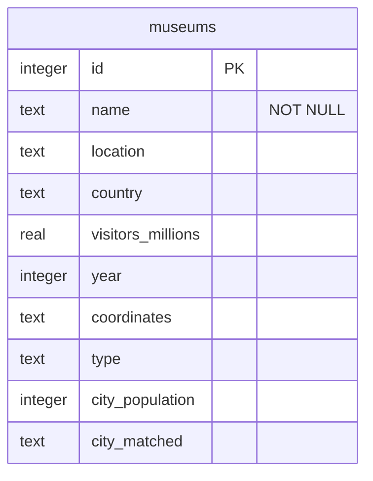

# Implementation Plan: Museum Attendance vs City Population Analysis

## Overview

This document outlines the architectural decisions, design rationale, and trade-offs made in implementing a data pipeline and machine learning system to correlate museum visitor attendance with city population data.

## Project Architecture

### 1. Data Acquisition Strategy

#### Wikipedia API Integration
- **Choice**: Direct HTTP requests to Wikipedia's REST API for museum data
- **Rationale**: 
  - Wikipedia provides structured data through its API with reliable uptime
  - Avoids web scraping complexities and respects rate limits
  - JSON response format is easy to parse and process
- **Trade-offs**:
  - **Pros**: Reliable, well-documented API with structured data format
  - **Cons**: Limited to Wikipedia's data quality and update frequency; potential for API changes breaking our pipeline

#### City Population Data Source
- **Choice**: UN Statistics Division (UNSD) city population dataset
- **Rationale**:
  - Official UN data provides authoritative population figures
  - Available as downloadable CSV with consistent formatting
  - Covers major cities worldwide with standardized naming
- **Trade-offs**:
  - **Pros**: Authoritative and reliable data source with standardized format and naming conventions
  - **Cons**: May not have real-time updates; city name matching requires fuzzy logic for accuracy

### 2. Data Storage & Persistence

#### Database Choice: SQLite
- **Rationale**:
  - Lightweight, serverless database perfect for MVP and development
  - No additional infrastructure required for deployment
  - Built-in Python support with sqlite3 module
  - ACID compliance ensures data integrity
- **Trade-offs**:
  - **Pros**: Zero configuration and maintenance overhead; perfect for single-user applications and prototypes; easy to backup and version control
  - **Cons**: Limited concurrent write performance; not suitable for high-traffic production scenarios; no network access (requires file system access)

#### Schema Design



```sql
-- Museums table with comprehensive metadata
CREATE TABLE museums (
    id INTEGER PRIMARY KEY,
    name TEXT NOT NULL,
    location TEXT,
    country TEXT,
    visitors_millions REAL,
    year INTEGER,
    coordinates TEXT,
    type TEXT,
    city_population INTEGER,
    city_matched TEXT
);
```

### 3. Machine Learning Approach

#### Model Selection: Linear Regression
- **Choice**: Log-log linear regression (log(visitors) ~ log(population))
- **Rationale**:
  - Simple, interpretable model suitable for initial exploration
  - Log transformation handles wide range of values (population and visitors)
  - Provides coefficient interpretation as elasticity
  - Fast training and prediction for real-time API responses
- **Trade-offs**:
  - **Pros**: Highly interpretable results; fast training and inference; handles scale differences through log transformation
  - **Cons**: Assumes linear relationship in log space; limited feature engineering capabilities; may miss complex non-linear patterns

#### Feature Engineering Strategy
- **Features Used**:
  - Primary: City population (log-transformed)
  - Secondary: Country, museum type (categorical encoding potential)
- **Missing Data Handling**:
  - Remove records with missing critical data (population or visitors)
  - Log invalid operations for monitoring
- **Validation Approach**:
  - Simple train/test split for initial validation
  - Cross-validation for more robust estimates in future iterations

### 4. Software Architecture

#### Package Structure
```
src/
├── database.py    # Data access layer
├── etl.py        # Extract, Transform, Load pipeline
├── model.py      # ML training and prediction
├── api.py        # FastAPI web service
└── cli.py        # Command-line interface
```

#### Design Patterns Applied
- **Separation of Concerns**: Clear module boundaries for data, ML, and API layers
- **Dependency Injection**: Database connections passed as parameters
- **Factory Pattern**: Model loading and persistence abstraction
- **Error Handling**: Comprehensive exception handling with logging

### 5. API Design

#### RESTful Endpoints
- `GET /health`: System health monitoring
- `GET /metrics`: Model performance and system metrics
- `POST /predict`: Visitor prediction based on city population

#### Design Decisions
- **Choice**: FastAPI framework
- **Rationale**:
  - Automatic API documentation with OpenAPI/Swagger
  - Built-in data validation with Pydantic
  - High performance with async support
  - Type hints integration
- **Trade-offs**:
  - **Pros**: Excellent developer experience with auto-docs; built-in validation and serialization; modern Python async/await support
  - **Cons**: Slightly higher memory footprint than Flask; learning curve for teams unfamiliar with async patterns

### 6. Deployment Strategy

#### Containerization with Docker
- **Multi-service Architecture**:
  - Web API container: Serves prediction endpoints
  - Notebook container: Interactive data exploration
  - Shared volume mounting for development

#### Docker Design Decisions
- **Base Image**: `python:3.13-slim`
  - Balances size and functionality
  - Official Python image with good security practices
- **Dependency Management**: UV package manager
  - Faster than pip with better dependency resolution
  - Lock file ensures reproducible builds
- **Development vs Production**:
  - Volume mounting for development iteration
  - Copy-based builds for production deployment

### 7. Development Workflow

#### Build System: Just + UV
- **Choice**: Just for task automation, UV for dependency management
- **Rationale**:
  - Just provides simple, shell-based task definitions
  - UV offers faster dependency resolution than pip
  - Clear separation between build tasks and dependency management
- **Trade-offs**:
  - **Pros**: Fast dependency installation and resolution; simple, readable task definitions
  - **Cons**: Additional tools to learn and maintain; UV is newer and may have less ecosystem support

#### Testing Strategy
- **Unit Tests**: Focus on core business logic
- **Integration Tests**: API endpoint testing
- **Coverage**: Aim for >80% code coverage on critical paths

## Scaling Considerations

### Immediate Next Steps (MVP+)
1. **Database Migration**: PostgreSQL for concurrent access
2. **Caching Layer**: Redis for frequently accessed predictions
3. **API Rate Limiting**: Prevent abuse and ensure fair usage
4. **Model Versioning**: Track and rollback model versions

### Long-term Scalability
1. **Microservices**: Separate data ingestion, training, and serving
2. **Message Queues**: Async processing for ETL pipelines
3. **Model Serving**: Dedicated ML serving infrastructure (e.g., MLflow)
4. **Monitoring**: Comprehensive observability with metrics and alerting

## Trade-off Analysis

### Development Speed vs. Production Readiness
- **Chosen**: Rapid prototyping with clear migration path
- **Rationale**: MVP requirements prioritize quick assessment and deployment
- **Implications**: Some technical debt acceptable for faster time-to-market

### Accuracy vs. Interpretability
- **Chosen**: Simple, interpretable model over complex alternatives
- **Rationale**: Stakeholder understanding more valuable than marginal accuracy gains
- **Implications**: May miss complex patterns but enables business understanding

### Infrastructure Complexity vs. Operational Overhead
- **Chosen**: Minimal infrastructure with SQLite and single-node deployment
- **Rationale**: Reduced operational complexity for initial deployment
- **Implications**: Limits concurrent usage but simplifies maintenance

## Data Quality Considerations

### Museum Data Quality
- **Challenge**: Wikipedia data inconsistency and formatting variations
- **Mitigation**: Robust parsing with error handling and manual validation
- **Monitoring**: Log parsing failures for continuous improvement

### City Name Matching
- **Challenge**: Variations in city names between museum locations and population data
- **Solution**: Fuzzy string matching with manual fallbacks
- **Future**: Implement geocoding for coordinate-based matching

### Missing Data Strategy
- **Current**: Exclude incomplete records from training
- **Future**: Implement imputation strategies for partial data
- **Monitoring**: Track data completeness metrics over time

## Security Considerations

### API Security
- **Current**: Basic input validation and sanitization
- **Future**: API key authentication and rate limiting
- **Monitoring**: Request logging and anomaly detection

### Data Privacy
- **Scope**: Public data only (Wikipedia and UN statistics)
- **Compliance**: No personal data collection or processing
- **Future**: If extending to proprietary data, implement privacy controls

## Performance Benchmarks

### Target Performance Metrics
- **API Response Time**: <200ms for predictions
- **ETL Pipeline**: Complete refresh <5 minutes
- **Model Training**: <30 seconds for current dataset size
- **Memory Usage**: <512MB for API container

### Optimization Opportunities
1. **Database Indexing**: Add indexes for frequent queries
2. **Model Caching**: Cache model artifacts in memory
3. **API Optimization**: Connection pooling and async processing
4. **Data Preprocessing**: Cache transformed features

## Conclusion

This implementation balances rapid development with a clear path to production scalability. The architecture prioritizes simplicity and interpretability while maintaining flexibility for future enhancements. Key design decisions favor developer productivity and stakeholder understanding over premature optimization, aligning with MVP requirements while establishing a foundation for growth.
